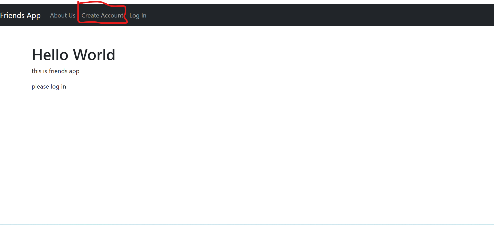
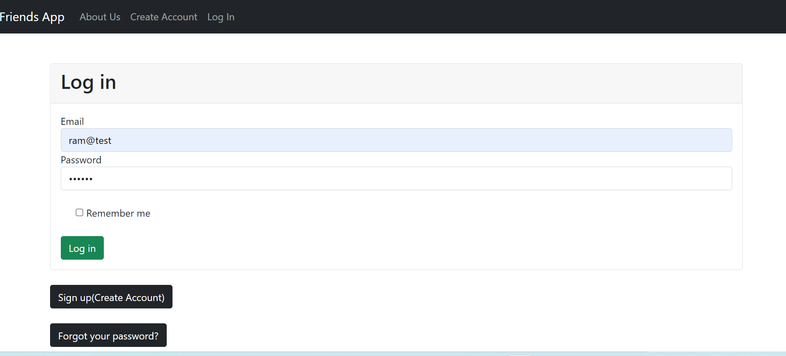
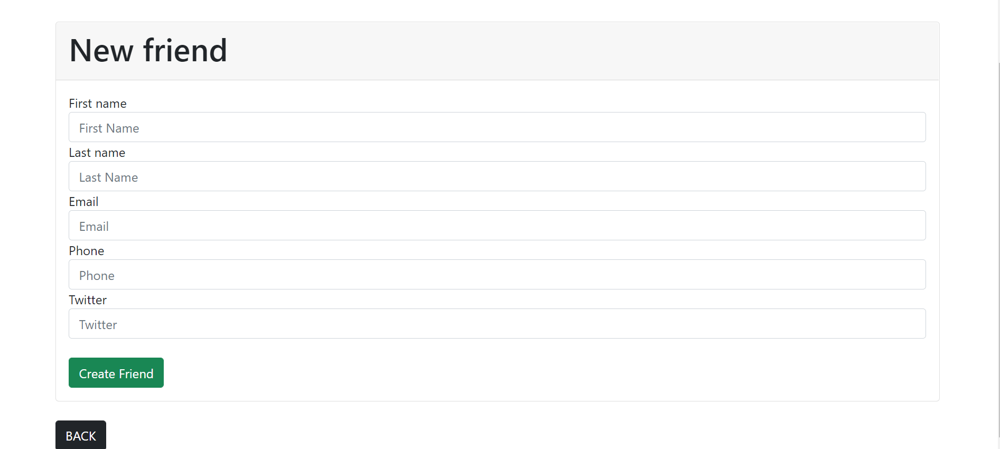
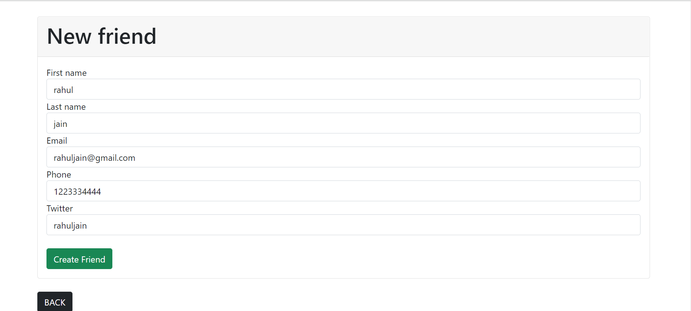
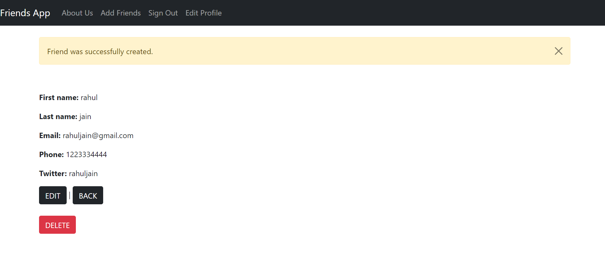
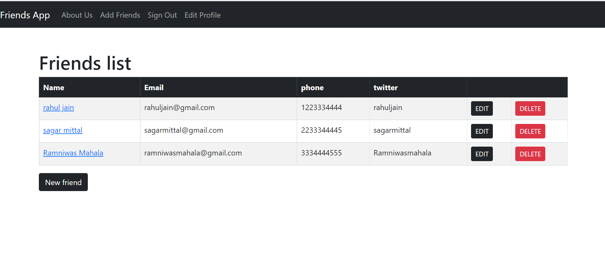
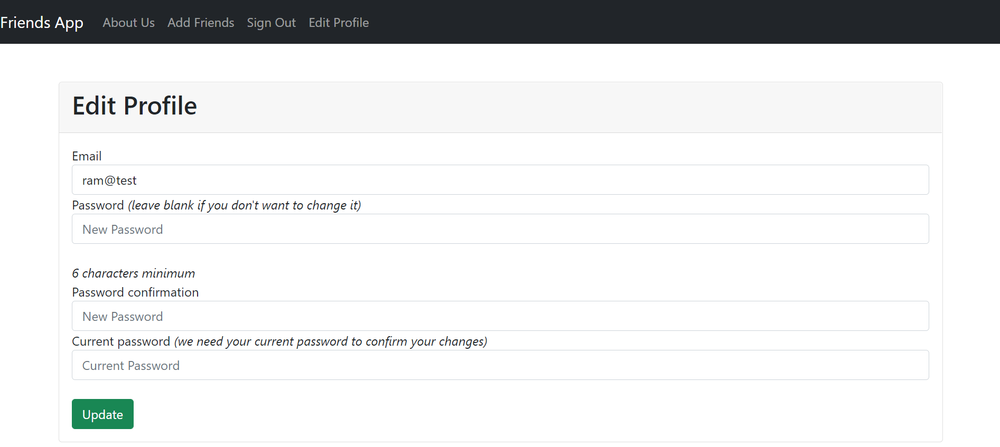
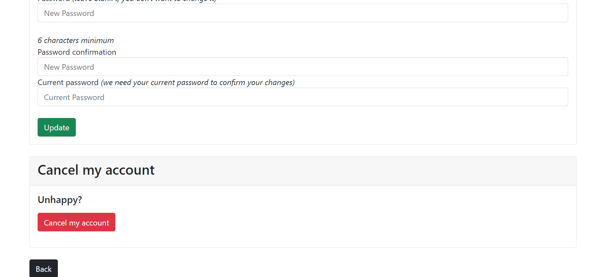

# README

This README would normally document whatever steps are necessary to get the
application up and running.

* Ruby version -- ruby 3.1.2p20

* rails version -- Rails 7.0.3.1

* For Use This Web App Follow These Steps
---
1. Create Account
2. Log in
3. click on New Friends button and creat new friend
4. click on back to friend and see table
5. if want to edit click on edit
6. if want to delete friend click on delete
7. if want to delete account go to edit profile and click on cancle my page

---

# Screenshots
# homepage

# account creation

# Log in page

# home page after login
* click on 'new friend' for create new friend in list

# new friend form

# new friend filled form 

# new friend created sucessfully

# friends list / home page

# edit friend data

# edit profile

# profile delete 
* if you want can you delete your profile

* if have any sugession contact on https://ramgopalsiddh.github.io/
* twitter   https://twitter.com/ramgopalsiddh1/
